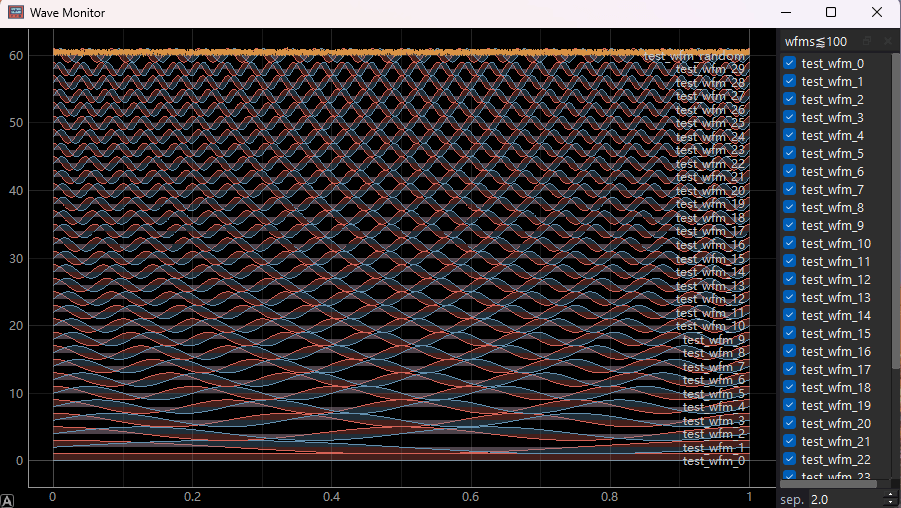

# Wave Monitor



一个用于监视波形的简单图形界面（GUI）。

`WaveMonitor` 是主要的 Python 接口。

此外图形界面也支持鼠标拖拽、右键菜单和快捷键操作。

## 安装

```bash
pip install WaveMonitor
```

## 用例

```python
from wave_monitor import WaveMonitor
import numpy as np

monitor = WaveMonitor()
monitor.autoscale()
monitor.clear()

t = np.linspace(0, 1, 1_000_001)  # 1m pts ~= 1ms for 1GSa/s.
n = 20
i_waves = [np.cos(2 * np.pi * f * t) for f in range(1, n + 1)]
q_waves = [np.sin(2 * np.pi * f * t) for f in range(1, n + 1)]

for i, (i_wave, q_wave) in enumerate(zip(i_waves, q_waves)):
    monitor.add_wfm(f"wave_{i}", t, [i_wave, q_wave])
monitor.autoscale()

monitor.add_wfm("wave_1", t, [i_waves[-1], q_waves[-1]])  # Replaces previous wfm.
monitor.add_note("wave_1", "re-writen")

monitor.remove_wfm("wave_10")
```

## WaveMonitor 接口说明

- `WaveMonitor(create_window: bool = True)`
  
    构造函数，会启动后台 I/O 线程并尝试连接到已有的 monitor 窗口。
    如果没有窗口且 `create_window=True` 则会尝试创建一个新窗口。
    通过此方法创建的新窗口会在Python进程结束时被关闭（Windows限制）。
    你也可以通过直接在终端中运行 `start-wave-monitor` 来创建窗口，相关的.exe文件在pip安装后就被自动创建了。

- `add_wfm(name: str, t: np.ndarray, ys: list[np.ndarray], dtype: np.float32 | None = np.float32) -> None`

  添加或替换一个命名波形。
  `t` 为一维 numpy 数组（横轴），
  `ys` 为与 `t` 形状相同的一组一维 numpy 数组（可多通道）。
  函数是非阻塞的。

- `add_note(name: str, note: str) -> None`

  给指定波形添加一条文本注释。

- `remove_wfm(name: str) -> None`

  从图中移除指定名称的波形。

- `clear() -> None`

  将所有波形设置为零。
  为减少重复创建波形的开销，这不会从列表中删除波形。
  你仍可通过界面右键将其移除。

- `autoscale() -> None`

  缩放窗口视图。

- `disconnect() -> None`

  断开与 monitor 窗口的连接。

- `connect(timeout_ms: int = 100) -> bool`

  尝试建立到 monitor 的连接，返回是否成功。

- `find_or_create_window(log_level: Literal["WARNING","INFO","DEBUG"] = "INFO", timeout_s: float = 10) -> None`

  连接到已有窗口或通过运行 `start-wave-monitor` 启动一个新进程并等待其就绪。
